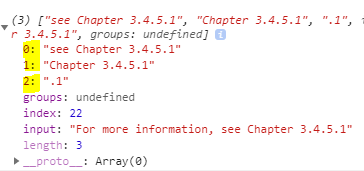

# 정규표현식 regex

실제 문자열 관련 알고리즘을 풀 때, 많이 사용하는 것같아서 정리한다.

# 🍳 정규 표현식

> **정규 표현식**은 **문자열**에 나타나는 **특정 문자 조합과 대응**시키기 위해 사용되는 **패턴**이다.

**자바스크립트에서 정규 표현식을 사용하는 메서드들**

- **RegExp 객체**
 exec 메서드, test 메서드
- **String 객체**

    match 메서드, replace 메서드, search 메서드, split 메서드 등

## 정규 표현식 만들기

자바스크립트에서 정규 표현식을 만드는 방법은 두 가지가 있다.

1. **정규 리터럴**

    "/"로 감싸서 사용하는 패턴 

    스크립트가 불려와 질 때, 컴파일된다.

    정규식이 상수라면 리터럴 방식을 사용하자.

    ```jsx
    const reg = /ab+c/;
    ```

2. **RegExp 객체**의 **생성자 함수** 사용

    ```jsx
    let reg = new RegExp("ab+c");
    ```

    실행 시점에 컴파일된다. 

    정규식 패턴이 변경될 수 있는 경우, 혹은 사용자 입력과 같은 다른 출처로 부터 패턴을 가져오는 경우에는 생성자 함수를 사용하자.

## 자바스크립트에서 정규 표현식 사용하기

### RegExp.test 메서드

주어진 문자열이 정규 표현식을 **만족하는지 판별**하고 `true`, `false`로 반환

```jsx
// 코드는 mdn 문서 참조
// RegExp.test 메서드
    const str = 'table football foosball'; 
    const regex = new RegExp('foo*');
    const globalRegex = new RegExp('foo*', 'g'); // g는 전부 찾겠다는 의미

    // g 플래그를 사용하지 않은 경우
    console.log(regex.test(str)); // true

    // g 플래그를 사용했을 경우!
    console.log('g플래그 사용');
    console.log(globalRegex.test(str)); // true
    console.log(globalRegex.lastIndex); // 9
    console.log(globalRegex.test(str)); // true
    console.log(globalRegex.lastIndex); // 18
    console.log(globalRegex.test(str)); // false
```

**g 플래그**를 **사용**했을 경우

**처음** `test`를 실행했을 때 알맞는 문자열을 찾고 찾은 위치 인덱스를 저장한다. = `lastIndex`

**다음** `test`메서드를 호출 했을 경우, **중복된 값을 찾지않고** 다음 일치문자를 찾기위해서 **저장한 위치 인덱스(lastIndex) 부터** 정규표현식 만족 여부를 **판별**한다.

### String.match(regexp)

문자열이 정규식과 매치되는 부분을 검색한다.

**매개변수**

정규표현식 객체. 만약 정규표현식이 아닌 객체가 전달되더라도 `new RegExp(obj)`를 실행해 암묵적으로 RegExp 객체로 변환시킨다.

**리턴값**

일치하는 문자열을 찾은 경우 - **배열에 문자열에 대한 정보를 저장한다.**

1. 첫번째 요소는 입력받은 문자열
2. 매치되는 문자열
3. 그룹으로 묶은 문자열
4. ...

없다면 `null`을 리턴

```jsx
// 코드는 mdn 문서 참조
    // String.match 메서드
    const str2 = 'For more information, see Chapter 3.4.5.1';
    // ()는 그룹을 의미, \d는 숫자를 의미 \. 은 특수문자 . 을 의미
    // 플래그 i는 대소문자 구분 x
    // see chapter 
    const re = /see (chapter \d+(\.\d)*)/i;
    const found = str2.match(re);

    console.log(found);
```



**결과값**

배열의 첫번째 요소에는 입력받은 문자열이 들어있다.

두번째와 세번째 요소에는 ( ) 그룹으로 묶은 문자열들이 들어있다.

### String.search( regex )

**반환값**

해당 정규표현식에 맞는 문자의 인덱스를 반환한다.

**가장 첫번째**로 찾은 값의 인덱스를 반환한다.

없다면 -1을 반환한다.

```js
const str3 = 'The quick brown fox jumps over the lazy dog. If the dog barked, was it really lazy?';
    // 대괄호 속 ^는 해당 요소를 찾지않는다는 의미다 [^]
    // \w 문자 \s 하나의 공백 문자
    // [^\w\s] 는 문자와 공백문자로 시작하는 문자가 아닌 것을 찾는다는 뜻
    // 플래그 g는 모든 요소를 찾는다는 의미
    const regex3 = /[^\w\s]/g;

    // search는 가장 첫번째로 찾은 매치값의 인덱스를 반환한다.
    // 만약 \s를 안쓰면 화이트 스페이스를 찾는다. The 옆에 빈 문자
    console.log(str3.search(regex3)); 
    console.log(str3[str3.search(regex3)]); // . <-dog 옆에 있는문자.
```

### String.replace( )

패턴에 일치하는 부분을 원하는 문자열로 교체한다

**매개변수**

`regexp` | `substr`

패턴으로 사용할 정규표현식이나 문자열을 넣는다.

`newSubstr` | `function`

대체할 문자열 또는 대체하는 문자열을 생성하기 위해 호출되는 함수를 넣는다.

**반환값**

대체된 새로운 문자열을 반환한다.

절대 기존의 String객체를 수정하지 않는다.

```js
const str4 = 'The quick brown fox jumps over the lazy dog. If the dog barked, was it really lazy?';
    // 첫번째 dog를 monkey로 대체한다.
    console.log(str4.replace('dog', 'monkey'));

    // 대소문자 구분없이 가장 첫 dog를 찾아 ferret으로 변경한다.
    const regex4 = /Dog/i;
    console.log(str4.replace(regex4, 'ferret'));

    // 대소문자 구분없이 모든 dog를 찾아 cat으로 변경
    const regex5 = /Dog/ig;
    console.log(str4.replace(regex5, 'cat'));
```

---

## 참고 자료

[정규 표현식 - JavaScript | MDN](https://developer.mozilla.org/ko/docs/Web/JavaScript/Guide/Regular_Expressions)

[패턴과 플래그](https://ko.javascript.info/regexp-introduction)

### 유용한 사이트

**Regex 연습 문제 사이트**

[RegexOne - Learn Regular Expressions - Lesson 1: An Introduction, and the ABCs](https://regexone.com/)